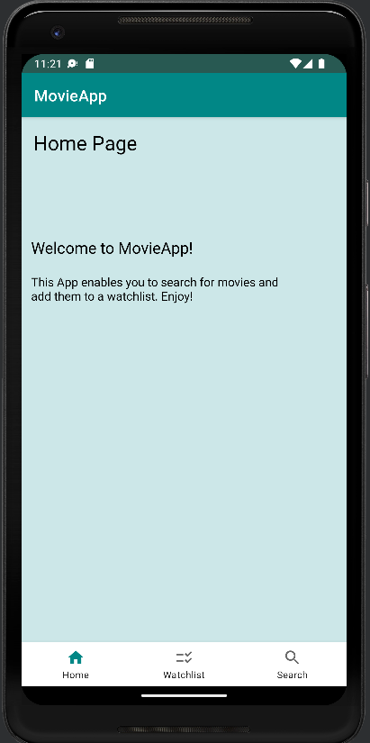
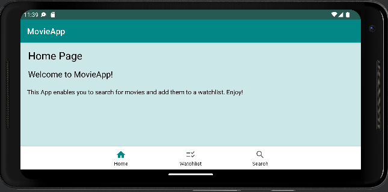
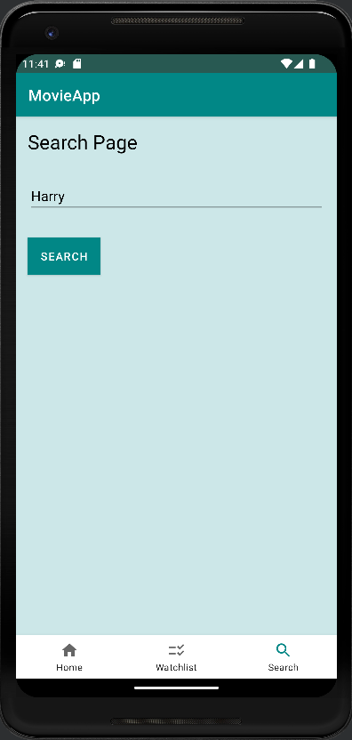
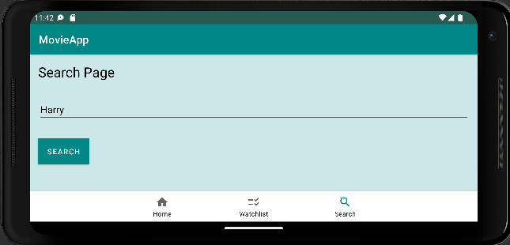
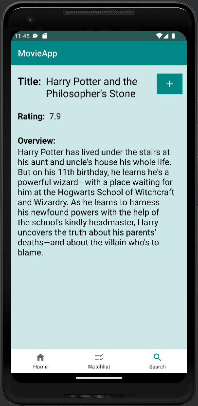
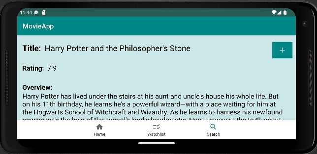
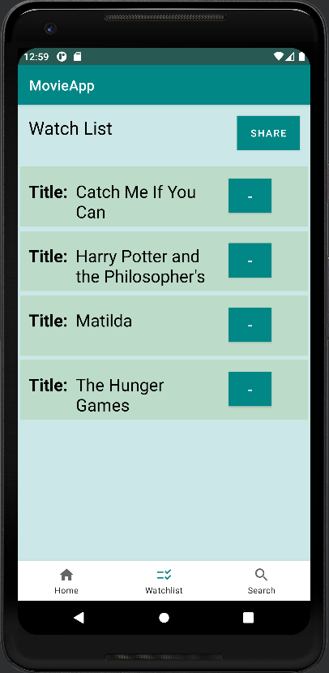
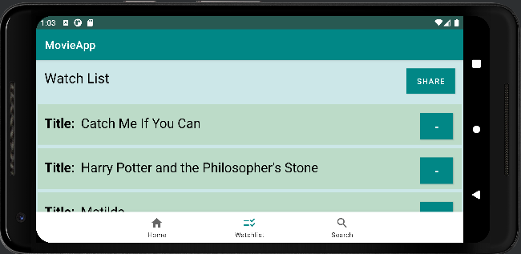

# App Description
## Author
Cordola O'Brien

## Title & Promo text for the app 
MovieApp provides information on movies and let's you create your own personal watchlist of movies.

## Description
MovieApp consists of 4 interlinking pages:
- A Home Page welcoming users to MovieApp.
- A Search Page where users can type in a movie title and search for a specific movie.
- A Landing Page where the searched movie is displayed. Info such as title, rating and overview are given.
  The user can click on a button to add the searched movie to his watchlist.
- A Watchlist which displays all the movies that the users has added.
  The user can click on a button to remove a specific movie from the watchlist.
  The user can click on a movie to open its landing Page, which gives information about the specific movie.
  The user can click on a share button to share his watchlist.
- A BottomNavigation which enables the user to navigate between home, search and watchlist fragments.

# App Design
## Use cases
The user can:
- view home page
- view search page
- view movie (through search)
- view movie (through watchlist)
- view watchlist (with all movies added)
- search for a movie
- add movie to watchlist
- delete movie from watchlist
- share watchlist

## Fragment Pages
All pages below are implemented as a fragment, hosted in MainActivity, connected by navigation components.
All fragments provide a portrait and landscape orientation, most of them have an extra xml-file for landscape format.
### Home page
- This is the first screen when opening the app.
- Using LinearLayout & TextViews. 
- Displays welcome text for users.
  | Portrait | Landscape |
  | ------ | ------ |
  |  |  |

### Search Page
- Using LinearLayout, TextView, EditText & Button.
- The user can give input for searched movie & click searchButton to get to the Landing Page.
  | Portrait | Landscape |
  | ------ | ------ |
  |  |  |

### Landing Page
- Using LinearLayout, ScrollView, TextView & Button. 
- LinearLayout allows to vertically and horizontally align widgets.
- The ScrollView enables the user to scroll up and down if the output is exceeding the screen capacity.
- Returns information (output) of movie searched (input) by user.
- User can add the searched movie to his watchlist by clicking the addButton.
  | Portrait | Landscape |
  | ------ | ------ |
  |  |  |

### Watch List
- Using ConstraintLayout, LinearLayout, TextView, Button & RecyclerView.
- Screen to view all movies of user's watchlist.
- Uses a RecyclerView with a custom layout file for each item. The item displays the item's movie name and a button to remove the item.
- By clicking on the movie itself, the user is directed to the Landing Page of the movie.
- By clicking the deleteButton, the movie is removed from the watchlist & database.
- By clicking on the shareButton, the user is able to share a list of the movies with other people via social network.
  | Portrait | Landscape |
  | ------ | ------ |
  |  |  |

## Navigation
- Based on FragmentContainer (navigation graph) & BottomNavigation menu
- Navigation via BottomNavigation menu to provide navigation between home, watchlist & search Page
- Navigation via SearchButton, ShareButton and via Click on item in watchlist

## Lifecycle Events
- Uses lifecycle aware views like onCreate() to ensure UI remains consistent
- Uses lifecycle listeners to act upon user input and invoke callback methods.

## Web service & JSON Processing
Uses themoviedb API, providing HTTP API for getting movie information to display on Landing Page, exchanged using JSON.
Functionality for processing JSON data retrieved within LandingPage fragment
Information fetching: id, title, overview, rating and original language of movies.

## Data store
Stores data in a single RoomsQL database table for storing movies of the watchlist.
Columns: Id, Title, Overview, Rating and Language.

## Mobile specific functionalities
- Share Function:
  By clicking on the shareButton, the user can choose with which app he wants to share his watchlist.
  The watchlist is displayed in one text, so the user is able to send it to other people.
- Adaptive Layout:
  The app is displayable in Portrait & Landscape orientation. For some pages, an extra xml file ensures Landscape format.
- BottomNavigation Tool
  This tool enables a user-friendly navigation for the user.

# Testing
[View testing file](https://github.com/WorkAtRGU/cm3110-coursework-Coconut237/blob/master/Testing.md)

